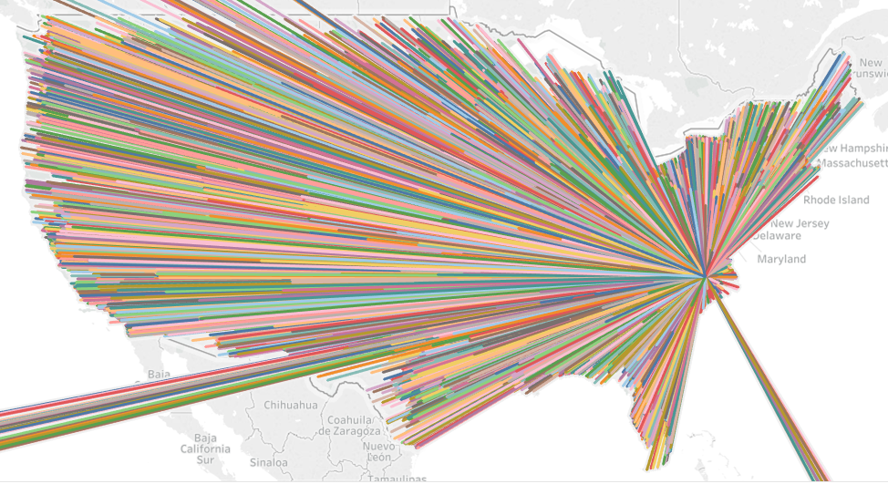

# Does Speed Matter in E-Commerce?

The following are support files for 2019 2nd Summer Semester DSBA 6211 Group Project. The project followed the QVC Analytics challenge, analyizing QVC sales data.

The input and output data files are too large for upload. Therefore, note the following:

* The input data files are part of the QVC Analytics Challenge data set, available in other places on the internet.
* Output files can be generated from the available R files once input files are obtained
* The county shape files used are Tiger/Line Shape Files provided by the US Census Bureau, and can be found [here](https://www.census.gov/geographies/mapping-files/time-series/geo/tiger-line-file.html). 

The project set out to answer three questions:

1. Does the current distribution network maximize customer penetration (spend)? If not, what should QVC do to increase customer penetration with the current distribution network?
2. Are there specific products or product categories that should be located in specific distribution centers?
3. Do customers that receive their product sooner purchase more than customers with longer delivery times?

