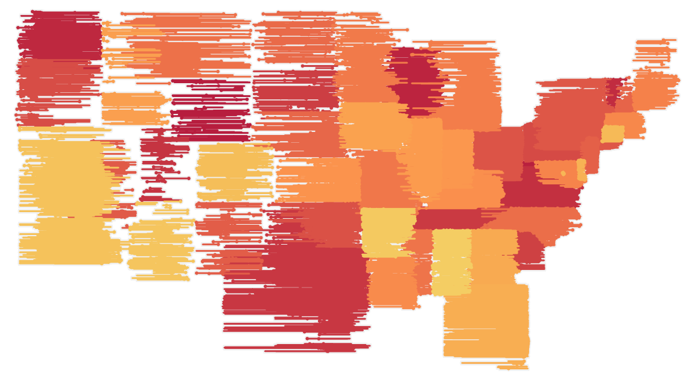
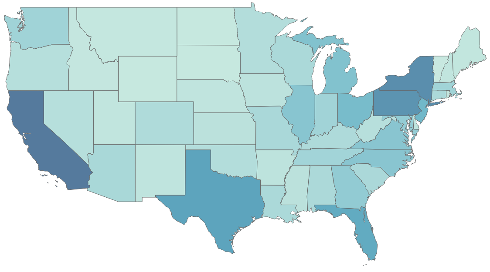
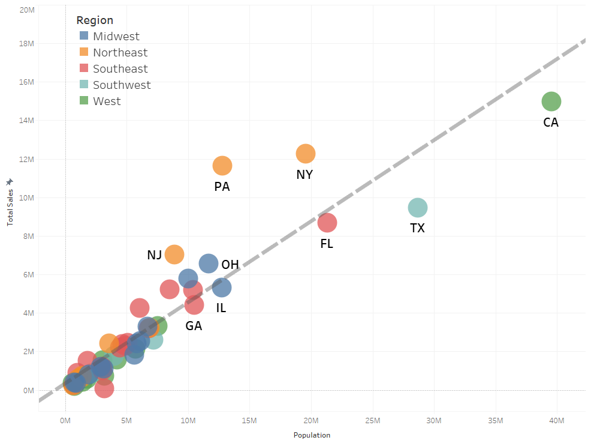
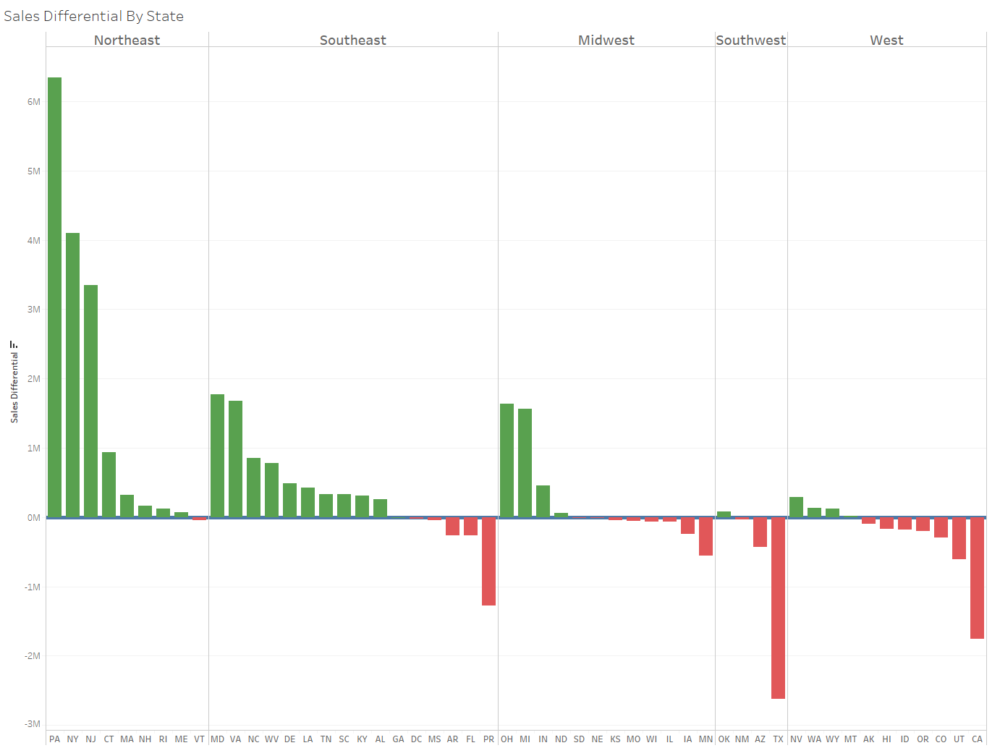
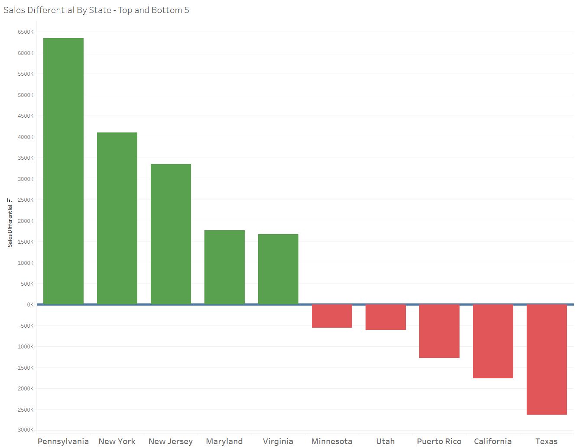
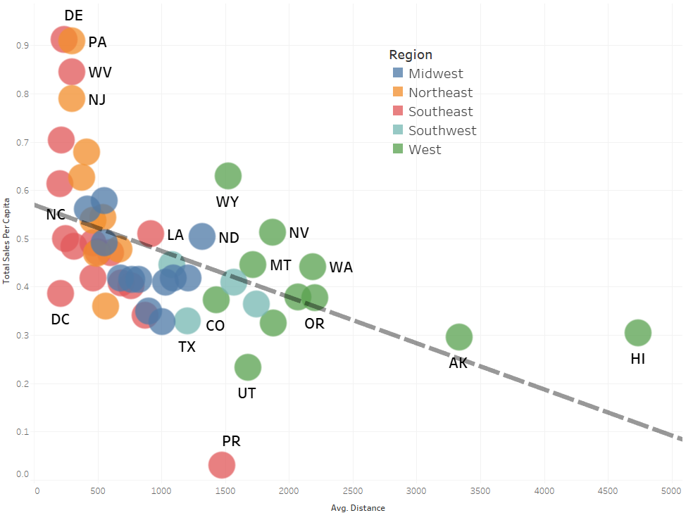
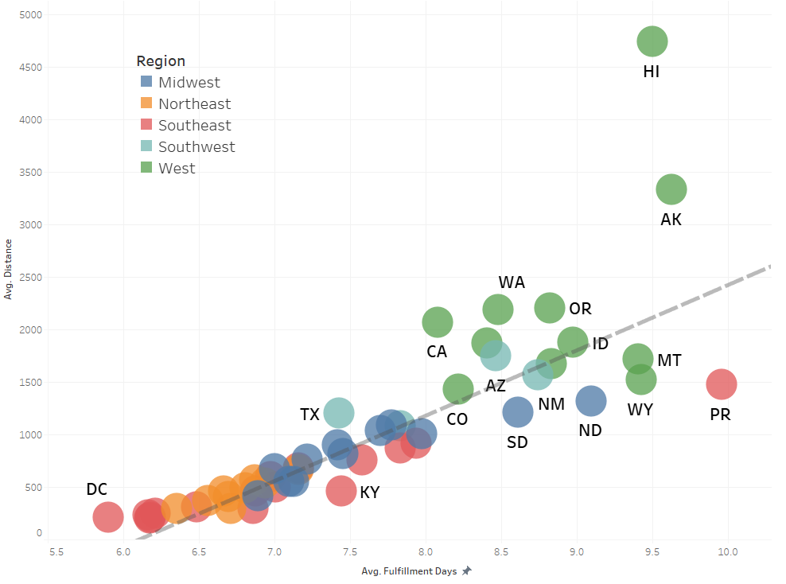
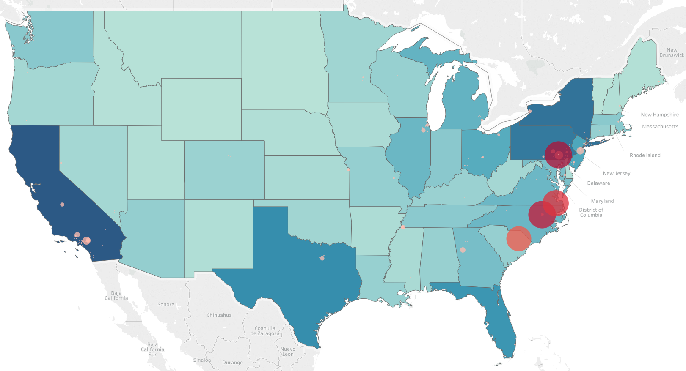

# Does Speed Matter in E-Commerce?

## Overview 

This GitHub repo contains the support files for the final group project for UNC Charlotte DSBA 6211 (Advanced Business Analytics), Summer Semester II, 2019.

The input and output data files are too large for upload. Therefore, note the following:

* The input data files are part of the QVC Analytics Challenge data set, available in other places on the internet. As of August 7, 2019, all input data files could be found on the [AIS Student Chapter Leadership Conference](http://sc.aisnet.org/conference2018/student-competitions/qvc-challenge/) website.
* Output files can be generated from the available R files once input files are obtained.
* The US census data files come from the 2018 National and State Population Estimates, found [here](https://www.census.gov/newsroom/press-kits/2018/pop-estimates-national-state.html).
* The county shape files used are Tiger/Line Shape Files provided by the US Census Bureau, found [here](https://www.census.gov/geographies/mapping-files/time-series/geo/tiger-line-file.html). 

The project set out to answer three questions:

1. Does the current distribution network maximize customer penetration (spend)? If not, what should QVC do to increase customer penetration with the current distribution network?
2. Are there specific products or product categories that should be located in specific distribution centers?
3. Do customers that receive their product sooner purchase more than customers with longer delivery times?

## Results

My work on the project was primarily focused on answering Question 1. Analyzing this question was done primarily through visual analytics. After processing the raw data into tidy data sets, data visuals were generated using Tableau. I generally prefer creating visuals through R, but the group was comprised of people with a variety of coding backgrounds and comforts. In order to provide a consistent visual palette, and use a product that everyone in the group would be comfortable with, Tableau was the visualization program used. This choice did allow me to expand on my Tableau skills. 

**TLDNR**

* QVC shipping capacity is nearly all concentrated in the East Coast
* Longer shipping distances lead to longer shipping times
* Longer shipping times correlate with reduced sales in a state. 
* Expand, or open new, distribution centers in California and Texas, and maybe Florida.

**Complete Results**

The following map shows QVC sales by state. A darker hue of blue indicates greater sales. The top states by sales are California, Texas, Florida, Pennsylvania, and New York.

### State Sales

  

The following plot is state sales versus population, where there is a linear relationship. The trend line added to the plot represents a baseline expected sales performance given a states population. States like Pennsylvania and New York are above that line, and therefore over perform. California, Texas, and Florida are under the line, and are therefore under performing. 

### State Sales vs. Population

  

So, Question 1 is reduced to what factor, or factors, lead to New York or Pennsylvania being above that line, and California, Texas, and Florida being below it. 

To help visualize which states were over performing and which were under performing, the difference between actual sales and expected sales (based on population) was calculated. The following plot breaks out that calculation by US region. You'll notice regions closer to the East of the United States appear to perform better than the West.

### State Performance By Region

  

The following are the top and bottom 5 states (or territories) based on sales performance difference.

### Top and Bottom 5 Performing States

  

One factor of this difference in sales performance appears to be the time between order to delivery, referred to as Fulfillment Time, and Fulfillment Time is directly related to the distance from distribution center to customer.

### Sales per Capital vs. Fulfillment Time

  

### Distance vs. Fulfillment Time

  

The primary reason for the large difference in Fulfillment Time across the US is the location of the distribution centers. While there are QVC distribution centers across the entire country, over 90% of shipping capacity travels from four locations, all on the east coast. The following plot shows the location of each distribution center, with the size corresponding to the number of orders shipped.

### Distribution Center Locations

  

